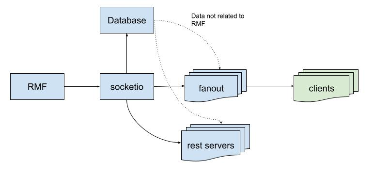

# Architecture

The simplest design is a single app that does all the needed functions, At first this seems fine until we start thinking about scaling it, the simplest approach would be to try and run multiple instances of the app, each subscribing to RMF topics and pushing them to clients. However, there are multiple problems if we simply try to replicate the app

* RMF does not provide all the data that we need. Some events have to be derived based on time-series data and/or multiple events.
* Each instance listens to RMF event without synchronization with others, if one instance miss or receive some messages late, it may cause the derived events to be different.
* If there ever is different history of events between instances, each will write to run their version into the database, we would get database conflicts there are not easily resolved.
* Each instance will be hitting the database constantly, particularly they will be hitting it with many duplicated write operations, traditional SQL-based databases does not work well in such workloads, eventual consistency based database will scale better but may create data conflicts as mentioned above.

In order to tackle the above mentioned issues, this is the current proposed architecture:

* A single instance socketio based app will subscribe to RMF events and write them to a database.
* All events published will be "stickied" or "transient local" in ros terms, it means any client that subscribes to the events will immediately receive the latest state.
* Additional socketio apps will subscribe to this main app and act as proxy/fanout.
* Additional rest based apps can connect to the proxies or directly to the main app.
* These additional apps will not write RMF events data to the database, however they may write non RMF data (e.g. user preferences).
* These additional apps will not derive any events, all derived events shall be received from the main socketio app.
* Dataflow from the other direction (from client to RMF) will all have to go through the main socketio app. However, it is assumed that RMF will be the bottleneck anyway.

## Other Considerations

### Failover/redundancy
The main socketio app will be a single point of failure.
* This is somewhat mitigated as it is able to use the database to restore it's state.
* Technologies like kubernetes can automatically restart a container when it crashes, minimizing downtime.
* Technically it is possible to run failover instances of the main app, we just need _very_ complicated logic to synchronize states across them.
