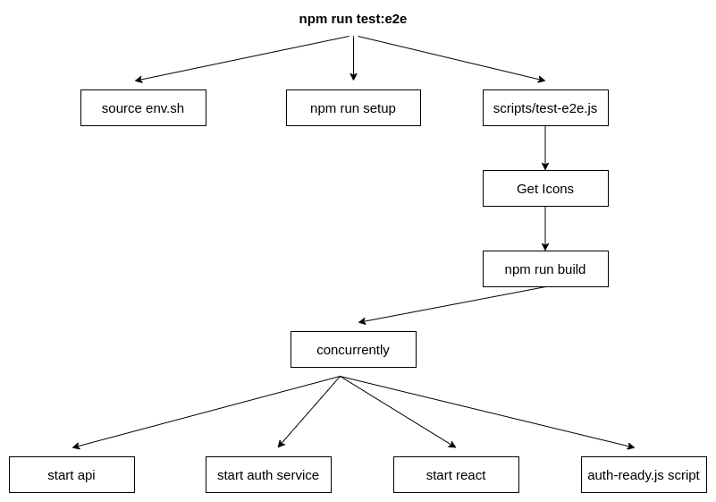

# Settings

There are some environment variables that control how the test runs.

| Key | Description |
|---|---|
| E2E_DOCKER_NETWORK | _(string)_ The network that services uses, defaults to `rmf-web_default` |
| E2E_NO_AUTH | _(bool)_ Do not launch the authentication provider service |
| E2E_NO_DASHBOARD | _(bool)_ Do not launch the dashboard server |
| E2E_NO_ROS2_BRIDGE | _(bool)_ Do not launch the ros2-bridge server |
| E2E_USER | _(string)_ The user to login with |
| E2E_PASSWORD | _(string)_ The password to login with |
| E2E_DASHBOARD_URL | _(string)_ Base url where the dashboard is hosted |

Boolean values can be 0/1/true/false.

There are also some environment variables the test runner sets by default

| Key | Default Value |
|---|---|
| REACT_APP_AUTH_PROVIDER | keycloak |
| REACT_APP_KEYCLOAK_CONFIG | { "realm": "master", "clientId": "romi-dashboard", "url": "http://localhost:8088/auth" } |
| REACT_APP_TRAJECTORY_SERVER | ws://localhost:8006 |
| REACT_APP_ROS2_BRIDGE_SERVER | ws://localhost:50002 |
| E2E_USER | admin |
| E2E_PASSWORD | admin |
| E2E_DASHBOARD_URL | http://localhost:5000 |

You can overwrite them by setting them in your environment variables.

# E2E workflow in CI

NOTE: This section only pertains to running the e2e tests in github workflows.

This is to document the flow and interaction of the e2e services in the github environment when:

- starting up the services
- running the tests

## Starting up the services

Below is a diagram representing the flow of commands when running `npm run test:e2e`

## Container and network interactions

The key difference between running the tests locally and in github workflows is that in github, the tests are ran from inside a container with docker-beside-docker. So, the docker commands connect to the host daemon, this causes that the "localhost" in GitHub refers to the container. "Localhost" in local runs refers to the host (where the docker daemon is running). Tests in CI runs wouldn't be able to connect to the auth service with "localhost" because when a port is "exposed" or "published" is mapped to the host and not the container.

Instead of host <-> container communication, we will need to do container <-> container communication. This is achieved by setting `E2E_DOCKER_NETWORK` to the github workflow's network and setting `REACT_APP_KEYCLOAK_CONFIG` to point to the auth service via the container name.
