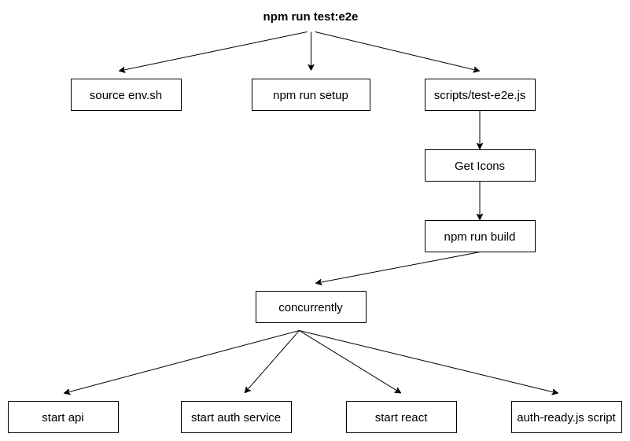
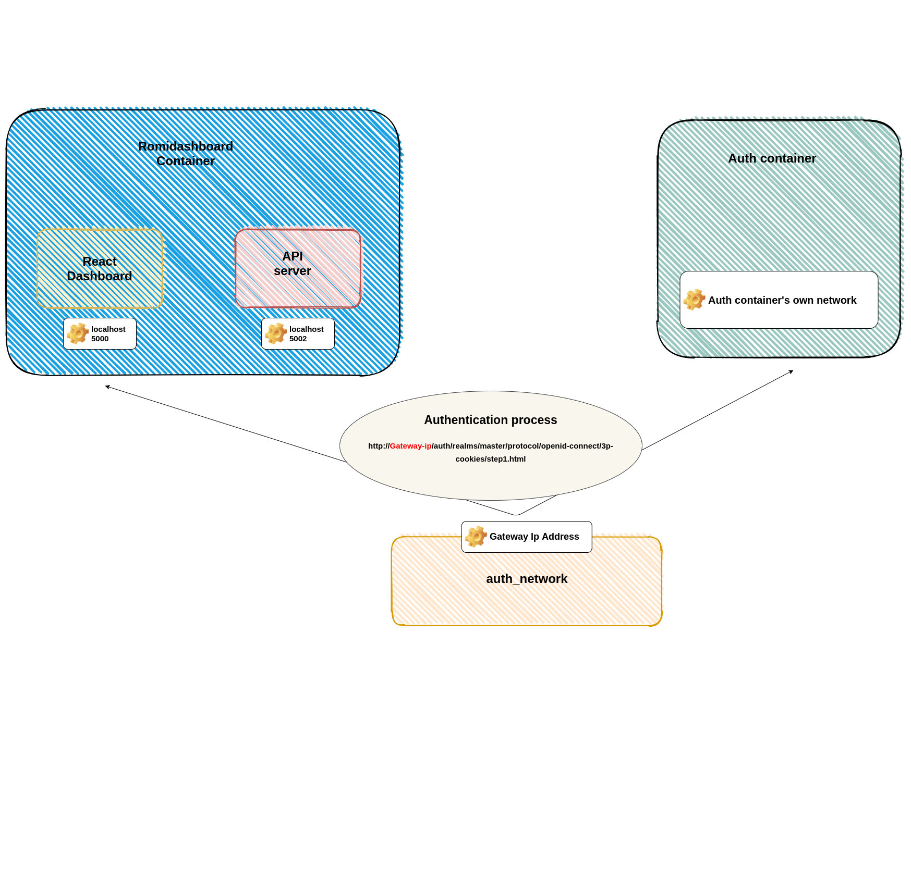

# E2E workflow

This is to document the flow and interaction of the e2e services in the github environment when:

- starting up the services
- running the tests

## Starting up the services

Below is a diagram representing the flow of commands when running `npm run test:e2e`



## Container and network interactions

Below is a diagram of how the containers and networks interact when up and running



Broadly speaking, there are 3 major parts of the system:

- Romidashboard container. It holds the API server and the React dashboard
- Auth container
- auth_network, a known network where the Auth container is reachable 

Requests from the romidashboard to the auth container would be routed to the gateway ip address of `auth_network`. Docker would then perform a NAT to route the requests to the auth container and vice versa.

The dashboard would need to be compiled with the gateway ip address of the `auth_network`. This is done by retrieving the ip address the moment the network is created and then have it set in the `url` paramenter of the `REACT_APP_AUTH_CONFIG` env variable.
```
const authConfig = {
  realm: 'master',
  clientId: 'romi-dashboard',
  url: `http://${defaultAuthGatewayIp ? defaultAuthGatewayIp : 'localhost'}:8080/auth`,
};
process.env.REACT_APP_AUTH_CONFIG = JSON.stringify(authConfig);
```