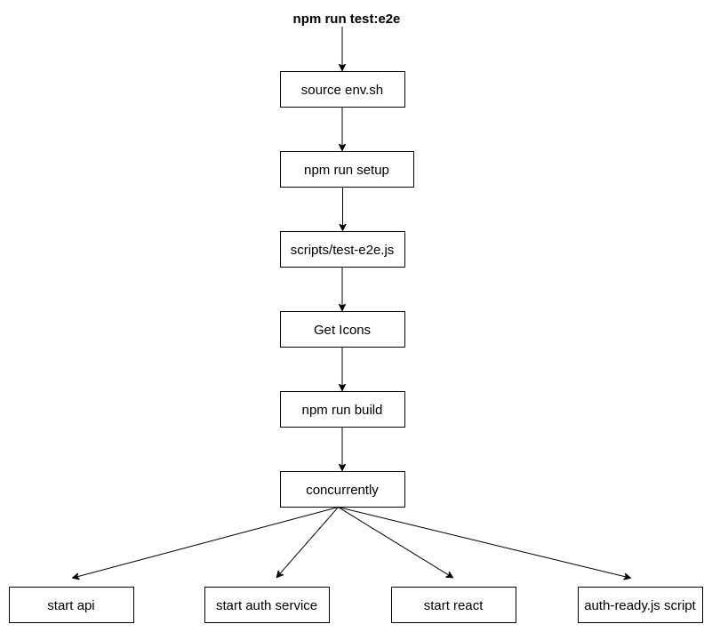

# E2E workflow

This is to document the flow and interaction of the e2e services in the github environment when:

- starting up the services
- running the tests

## Starting up the services

Below is a diagram representing the flow of commands when running `npm run test:e2e`

## Container and network interactions

Below is a diagram of how the containers and networks interact when up and running

Broadly speaking, there are 3 major parts of the system:

- e2e container, built from the `docker.pkg.github.com/osrf/rmf-web/e2e` image with the RMF backend compiled into it. It is the base image in each the CI will run on. Sourcing of RMF is required before running the tests and it can be sourced from `. /opt/rmf/setup.bash`, this is "Romidashboard Container" in the diagram.
- auth container (keycloak).
- a known docker bridge network where the auth container is reachable, this is "auth_network" in the diagram.

Requests from the client to the auth container would be routed to the gateway ip address of the auth network. Docker bridge would then perform a NAT to route the requests to the auth container and vice versa.

The e2e container cannot connect to the auth container by it's ip address because github starts it in a different network, it also cannot connect to localhost because github configured containers to work with docker-beside-docker (instead of docker-in-docker), so the ports exports on the auth container are exports to the _host_ network, and not the "localhost" within the e2e container.

The solution is to instead connect to the _gateway_ address of the auth network, this works because the e2e container is configured with a default route to its gateway, since the target ip is the _gateway_ of the auth network, which is infact going to be the host (it may also work if it connects to the gateway of it's own network).
