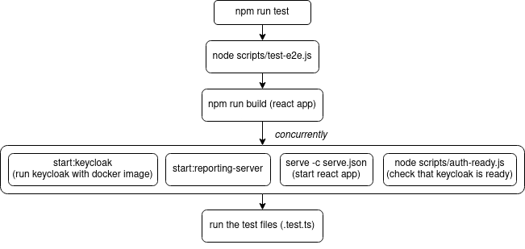

# Running with Keycloak

The tests are run with keycloak as the authentication server and we use docker and docker-compose to simplify the setup of keycloak.

## Ubuntu 20.04

Install docker and docker-compose
```bash
sudo apt update && sudo apt install docker.io docker-compose
```

If you're using GNOME or KDE, there will be a pop-up window to ask for privilege escalation when running the Docker container which runs Keycloak, the authentication mechanism we are currently using.
If you're using `i3` or other "unusual" window managers, this pop-up may not occur, which can be confusing since a password prompt can be easily lost in the console text stream.
You can add yourself to the `docker` group to allow containers to start without requesting your password:
```
sudo usermod -aG docker $USER
```
After issuing this command, you may need to logout/login or restart your system depending on your OS/environment.

Keep in mind that this convenience has security implications. This tradeoff is described in more detail in the Docker documentation:
https://docs.docker.com/engine/install/linux-postinstall/#manage-docker-as-a-non-root-user

## Others

See

* [docker](https://docs.docker.com/engine/install/ubuntu/)
* [docker-compose](https://docs.docker.com/compose/install/)

# Settings

There are some environment variables that control how the test runs.

| Key | Description |
|---|---|
| E2E_DOCKER_NETWORK | _(string)_ The network that services uses, defaults to `rmf-web_default` |
| E2E_NO_AUTH | _(bool)_ Do not launch the authentication provider service |
| E2E_NO_REPORTING | _(bool)_ Do not launch the reporting ui server |
| E2E_NO_REPORTING_SERVER | _(bool)_ Do not launch the reporting server |
| E2E_USER | _(string)_ The user to login with |
| E2E_PASSWORD | _(string)_ The password to login with |
| E2E_REPORTING_URL | _(string)_ Base url where the dashboard is hosted |

Boolean values can be 0/1/true/false.

There are also some environment variables the test runner sets by default

| Key | Default Value |
|---|---|
| REACT_APP_AUTH_PROVIDER | keycloak |
| REACT_APP_KEYCLOAK_CONFIG | { "realm": "master", "clientId": "reporting", "url": "http://localhost:8088/auth" } |
| E2E_USER | admin |
| E2E_PASSWORD | admin |
| E2E_REPORTING_URL | http://localhost:5000 |

You can overwrite them by setting them in your environment variables.

# E2E workflow in CI

NOTE: This section only pertains to running the e2e tests in github workflows.

This is to document the flow and interaction of the e2e services in the github environment when:

- starting up the services
- running the tests

## Starting up the services

Below is a diagram representing the flow of commands when running `npm run test:e2e`



## Container and network interactions

The key difference between running the tests locally and in github workflows is that in github, the tests are ran from inside a container with docker-beside-docker. So, the docker commands connect to the host daemon, this causes that the "localhost" in GitHub refers to the container. "Localhost" in local runs refers to the host (where the docker daemon is running). Tests in CI runs wouldn't be able to connect to the auth service with "localhost" because when a port is "exposed" or "published" is mapped to the host and not the container.

Instead of host <-> container communication, we will need to do container <-> container communication. This is achieved by setting `E2E_DOCKER_NETWORK` to the github workflow's network and setting `REACT_APP_KEYCLOAK_CONFIG` to point to the auth service via the container name.
